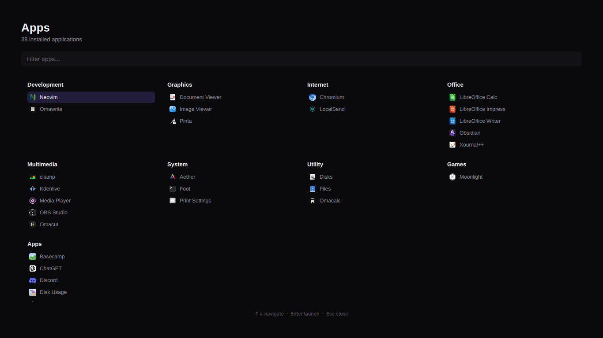

# Min Launcher

Fullscreen app launcher overlay for [Omarchy](https://omarchy.org) (Quickshell).

**Layout** inspired by Design Engineer Tools. **Items** are your installed native apps only (Omarchy `AppLibrary` / `.desktop` entries) — no web URLs.

Apps are grouped by FreeDesktop category (Development, Graphics, Internet, Office, Multimedia, System, Utility, Games, Apps).



## Install

```bash
omarchy plugin add https://github.com/maiosx/min-launcher.git --enable
```

Update:

```bash
omarchy plugin update min-launcher
```

## Summon

```bash
omarchy-shell shell toggle min-launcher
```

Suggested keybind in `~/.config/hypr/bindings.lua`:

```lua
o.bind("SUPER + SHIFT + L", "Min Launcher", "omarchy-shell shell toggle min-launcher")
```

## Usage

- Type to filter across all sections
- Click an app or **Enter** to launch via `AppLibrary.launch`
- **↑↓** move selection · **Esc** clear filter / close

## Remove

Disable and uninstall the plugin:

```bash
omarchy plugin disable min-launcher
omarchy plugin remove min-launcher
```

If you added a keybind, delete the `SUPER + SHIFT + L` line (or whatever binding you used) from `~/.config/hypr/bindings.lua`.

To wipe any leftover config under your home directory:

```bash
rm -rf ~/.config/omarchy/plugins/min-launcher
```

(Paths may vary slightly by Omarchy version; `omarchy plugin list` shows installed plugins.)

## Structure

```
manifest.json
Launcher.qml    Fullscreen multi-column overlay
Tools.js        AppLibrary list, filter, category grouping
Preview.png     Screenshot
README.md
LICENSE
```

## License

MIT
